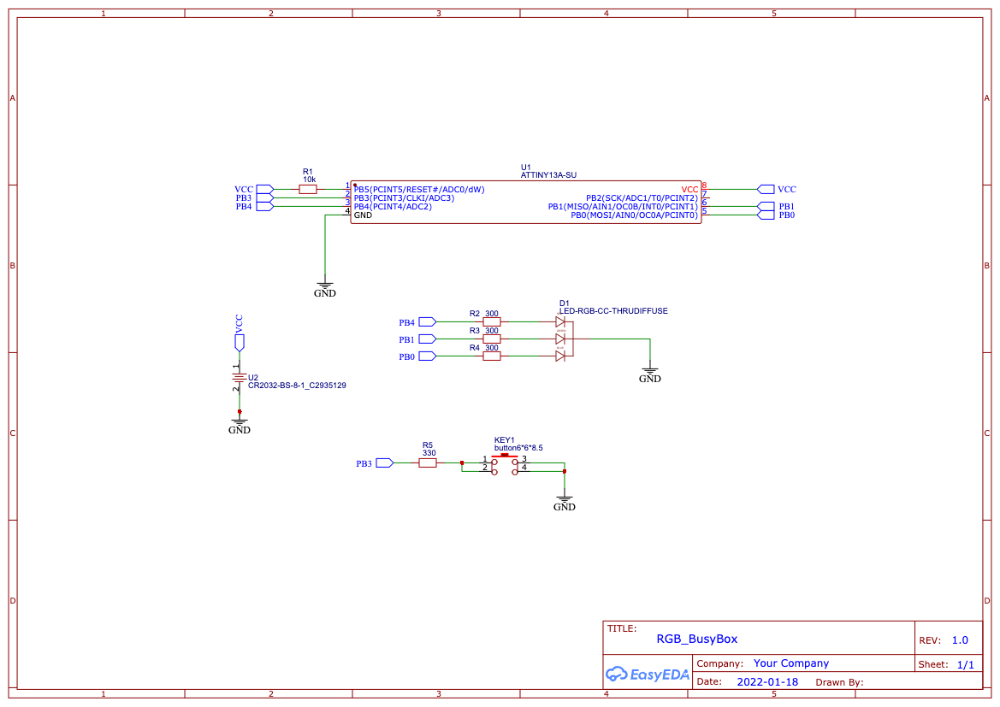

# Tiny Busybox Game

A little tiny busybox game with RGB led for baby

Using:
- Attiny13 - 1
- 300 Om - 3
- 10 KOm - 1
- Tact button (TS-12ASP) - 1
- RGB led (common cathode BL-L515RGBW-CC) - 1
- CR2032 - 1
- CR2032 Coin Battery Holder (CH25-2032) - 1

How its working:
- Short press starting multicolored light
- Long press stops lighting
- Auto stop lighting after ~ 40 sec

Scheme:

